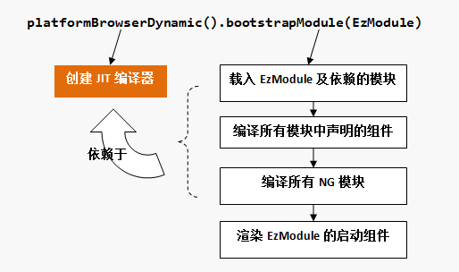

# angular

## 基础概念

```bash
npm install -g @angular/cli
ng new angular-tour-of-heroes
ng serve --open
ng generate component heroes
ng generate service hero
ng generate module app-routing --flat --module=app
```

### 架构

> Angular框架的核心是组件化，同时它的设计目标是适应大型应用的开发。因此，在应用开发中引入了模块（NgModule）的概念来组织不同的组件（及服务），一个Angular应用至少需要创建一个模块。
- NgModule装饰器\
  声明了一些关键的元数据，来通知框架需要载入哪些NG模块、编译哪些组件以及启动引导哪些组件
- 组件\
  组件控制屏幕上被称为视图的一小片区域。@Component 装饰器会指出紧随其后的那个类是个组件类，并为其指定元数据。组件的元数据告诉 Angular 到哪里获取它需要的主要构造块，以创建和展示这个组件及其视图。 具体来说，它把一个模板（无论是直接内联在代码中还是引用的外部文件）和该组件关联起来。 该组件及其模板，共同描述了一个视图。除了包含或指向模板之外，@Component 的元数据还会配置要如何在 HTML 中引用该组件，以及该组件需要哪些服务等等。
  理想情况下，组件的工作只管用户体验，而不用顾及其它。 它应该提供用于数据绑定的属性和方法，以便作为视图（由模板渲染）和应用逻辑（通常包含一些模型的概念）的中介者。
  - templateUrl：该组件的 HTML 模板文件相对于这个组件文件的地址
  - providers 是当前组件所需的依赖注入提供商的一个数组。
  - 当 Angular 创建组件类的新实例时，它会通过查看该组件类的构造函数，来决定该组件依赖哪些服务或其它依赖项。



- 平台对象的bootstrapModule()方法用来启动指定的NG模块，启动的绝大部分工作，在于利用JIT编译器编译NG模块和组件，当这些编译工作都完成后，则根据启动模块的bootstrap元信息，渲染指定的组件。
- 模版与视图

模板就是一种 HTML，它会告诉 Angular 如何渲染该组件。视图通常会分层次进行组织，让你能以 UI 分区或页面为单位进行修改、显示或隐藏。 与组件直接关联的模板会定义该组件的宿主视图。该组件还可以定义一个带层次结构的视图，它包含一些内嵌的视图作为其它组件的宿主。

- 指令\
  组件从技术角度上说就是一个指令，但是由于组件对 Angular 应用来说非常独特、非常重要，因此 Angular 专门定义了 @Component 装饰器，它使用一些面向模板的特性扩展了 @Directive 装饰器。
  除组件外，还有两种指令：结构型指令和属性型指令。和组件一样，指令的元数据把指令类和一个 selector 关联起来，selector 用来把该指令插入到 HTML 中。 在模板中，指令通常作为属性出现在元素标签上，可能仅仅作为名字出现，也可能作为赋值目标或绑定目标出现。

  - 结构型指令\
  结构型指令通过添加、移除或替换 DOM 元素来修改布局。
    - *ngFor 是一个迭代器。
    - *ngIf 是个条件语句。
  - 属性型指令
    属性型指令会修改现有元素的外观或行为。 在模板中，它们看起来就像普通的 HTML 属性一样，因此得名“属性型指令”。
    - ngModel 修改现有元素（一般是 \<input>）的行为：设置其显示属性值，并响应 change 事件。
- 服务\
  服务是一个广义的概念，它包括应用所需的任何值、函数或特性。狭义的服务是一个明确定义了用途的类。它应该做一些具体的事，并做好。
  组件不应该定义任何诸如从服务器获取数据、验证用户输入或直接往控制台中写日志等工作。 而要把这些任务委托给各种服务。通过把各种处理任务定义到可注入的服务类中，你可以让它可以被任何组件使用。 通过在不同的环境中注入同一种服务的不同提供商，你还可以让你的应用更具适应性。
- 依赖注入（dependency injection）\
  组件是服务的消费者，也就是说，你可以把一个服务注入到组件中，让组件类得以访问该服务类。在 Angular 中，要把一个类定义为服务，就要用 @Injectable 装饰器来提供元数据，以便让 Angular 可以把它作为依赖注入到组件中
  - 使用 @Injectable 装饰器来表明一个组件或其它类（比如另一个服务、管道或 NgModule）拥有一个依赖。 依赖并不必然是服务，它也可能是函数或值等等。
  - 依赖注入（通常简称 DI）被引入到 Angular 框架中，并且到处使用它，来为新建的组件提供所需的服务或其它东西。
    - 注入器是主要的机制。你不用自己创建 Angular 注入器。Angular 会在启动过程中为你创建全应用级注入器。
    - 该注入器维护一个包含它已创建的依赖实例的容器，并尽可能复用它们。
    - 提供商是一个创建依赖的菜谱。对于服务来说，它通常就是这个服务类本身。你在应用中要用到的任何类都必须使用该应用的注入器注册一个提供商，以便注入器可以使用它来创建新实例。

### 模板语法

- 插值表达式 ( {{...}} )\
  插值表达式可以把计算后的字符串插入到 HTML 元素标签内的文本或对标签的属性进行赋值。一般来说，括号间的素材（组件属性的名字）是一个模板表达式，Angular 先对它求值，再把它转换成字符串。
  - Angular 对所有双花括号中的表达式求值，把求值的结果转换成字符串，并把它们跟相邻的字符串字面量连接起来。最后，把这个组合出来的插值结果赋给元素或指令的属性。
- 模板表达式\
  模板表达式产生一个值。 Angular 执行这个表达式，并把它赋值给绑定目标的属性，这个绑定目标可能是 HTML 元素、组件或指令。
  - 表达式中的上下文变量是由模板变量、指令的上下文变量（如果有）和组件的成员叠加而成的。 如果你要引用的变量名存在于一个以上的命名空间中，那么，模板变量是最优先的，其次是指令的上下文变量，最后是组件的成员。
  - 模板表达式不能引用全局命名空间中的任何东西，比如 window 或 document。它们也不能调用 console.log 或 Math.max。 它们只能引用表达式上下文中的成员。
- 表达式指南
  - 没有可见的副作用 - 模板表达式除了目标属性的值以外，不应该改变应用的任何状态。
  - 执行迅速 - Angular 会在每个变更检测周期后执行模板表达式。 它们可能在每一次按键或鼠标移动后被调用。
  - 非常简单 - 常规是属性名或方法调用。偶尔的逻辑取反 (!) 也还凑合。 其它情况下，应在组件中实现应用和业务逻辑，使开发和测试变得更容易。
  - 幂等性 - 最好使用幂等的表达式，因为它没有副作用，并且能提升 Angular 变更检测的性能。在 Angular 的术语中，幂等的表达式应该总是返回完全相同的东西，直到某个依赖值发生改变。在单独的一次事件循环中，被依赖的值不应该改变。 如果幂等的表达式返回一个字符串或数字，连续调用它两次，也应该返回相同的字符串或数字。 如果幂等的表达式返回一个对象（包括 Date 或 Array），连续调用它两次，也应该返回同一个对象的引用。
- 模板语句\
  模板语句用来响应由绑定目标（如 HTML 元素、组件或指令）触发的事件。
  - 模板语句有副作用。 这是事件处理的关键。因为你要根据用户的输入更新应用状态。
  - 响应事件是 Angular 中“单向数据流”的另一面。 在一次事件循环中，可以随意改变任何地方的任何东西。
  - 和模板表达式一样，模板语句使用的语言也像 JavaScript。 模板语句解析器和模板表达式解析器有所不同，特别之处在于它支持基本赋值 (=) 和表达式链 (; 和 ,)。
- 绑定语法\
  数据绑定是一种机制，用来协调用户所见和应用数据。绑定的类型可以根据数据流的方向分成三类： 从数据源到视图、从视图到数据源以及双向的从视图到数据源再到视图。
  - 除了插值表达式之外的绑定类型，在等号左边是目标名， 无论是包在括号中 ([]、()) 还是用前缀形式 (bind-、on-、bindon-) 。
  - attribute 是由 HTML 定义的。property 是由 DOM (Document Object Model) 定义的。attribute 初始化 DOM property，然后它们的任务就完成了。property 的值可以改变；attribute 的值不能改变。模板绑定是通过 property 和事件来工作的，而不是 attribute。
  - 绑定目标 - 数据绑定的目标是 DOM 中的某些东西。 这个目标可能是（元素 | 组件 | 指令的）property、（元素 | 组件 | 指令的）事件，或(极少数情况下) attribute 名。
  - 如果名字没有匹配上已知指令或元素的属性，Angular 就会报告“未知指令”（unknown directive）的错误。
  - 只绑定数据属性和那些只返回值而不做其它事情的方法。模板表达式应该返回目标属性所需类型的值。
  - 方括号告诉 Angular 要计算模板表达式。 如果忘了加方括号，Angular 会把这个表达式当做字符串常量看待，并用该字符串来初始化目标属性。 它不会计算这个字符串。
  - 一次性字符串初始化 - 目标属性接受字符串值；字符串是个固定值，可以直接合并到模块中；这个初始值永不改变
- 使用 EventEmitter 实现自定义事件\
  通常，指令使用 Angular EventEmitter 来触发自定义事件。 指令创建一个 EventEmitter 实例，并且把它作为属性暴露出来。 指令调用 EventEmitter.emit(payload) 来触发事件，可以传入任何东西作为消息载荷。 父指令通过绑定到这个属性来监听事件，并通过 $event 对象来访问载荷。
  - 双向数据绑定 ( [(...)] )
    - 在元素层面上，既要设置元素属性，又要监听元素事件变化。Angular 为此提供一种特殊的双向数据绑定语法：[(x)]。 [(x)] 语法结合了属性绑定的方括号 [x] 和事件绑定的圆括号 (x)。
    - 双向绑定语法实际上是属性绑定和事件绑定的语法糖。
    - Angular 以 NgModel 指令为桥梁，允许在表单元素上使用双向数据绑定。

### 内置指令

- NgClass - 添加或移除一组 CSS 类

- NgStyle - 添加或移除一组 CSS 样式

- NgModel - 双向绑定到 HTML 表单元素

#### 内置属性型指令

属性型指令会监听和修改其它 HTML 元素或组件的行为、元素属性（Attribute）、DOM 属性（Property）。 它们通常会作为 HTML 属性的名称而应用在元素上。

#### 内置结构型指令

结构型指令的职责是 HTML 布局。 它们塑造或重塑 DOM 的结构，这通常是通过添加、移除和操纵它们所附加到的宿主元素来实现的。

- NgIf - 根据条件把一个元素添加到 DOM 中或从 DOM 移除
  - ngIf 指令通常会用来防范空指针错误。 而显示/隐藏的方式是无法防范的，当一个表达式尝试访问空值的属性时，Angular 就会抛出一个异常。
- NgSwitch 一组指令，用来在多个可选视图之间切换。
  - NgSwitch 指令类似于 JavaScript 的 switch 语句。 它可以从多个可能的元素中根据switch 条件来显示某一个。 Angular 只会把选中的元素放进 DOM 中。
  - NgSwitch 实际上包括三个相互协作的指令：NgSwitch、NgSwitchCase 和 NgSwitchDefault
- NgForOf - 对列表中的每个条目重复套用同一个模板

#### 模板引用变量 ( #var )

模板引用变量通常用来引用模板中的某个 DOM 元素，它还可以引用 Angular 组件或指令或Web Component.

- 使用井号 (#) 来声明引用变量。

#### 输入和输出属性

- 输入属性是一个带有 @Input 装饰器的可设置属性。当它通过属性绑定的形式被绑定时，值会“流入”这个属性。
- 输出属性是一个带有 @Output 装饰器的可观察对象型的属性。 这个属性几乎总是返回 Angular 的EventEmitter。 当它通过事件绑定的形式被绑定时，值会“流出”这个属性。
- 你只能通过它的输入和输出属性将其绑定到其它组件。
- 所有的组件都是指令。
- 你总是可以在组件自己的模板中绑定到组件的公共属性，而不用管它们是否输入（Input）属性或输出（Output）属性。这是因为组件类和模板是紧耦合的，它们是同一个东西的两个部分，合起来构成组件。 组件类及其模板之间的交互属于实现细节。
- Angular 编译器不会绑定到其它组件的属性上 —— 除非这些属性是输入或输出属性。
- 所有数据绑定属性必须是 TypeScript 的公共属性，Angular 永远不会绑定到 TypeScript 中的私有属性。
- 输入属性通常接收数据值。 输出属性暴露事件生产者，如 EventEmitter 对象。

#### 模板表达式操作符

##### 管道操作符 ( | )

- 管道是一个简单的函数，它接受一个输入值，并返回转换结果。
- 管道操作符会把它左侧的表达式结果传给它右侧的管道函数。

##### 安全导航操作符 ( ?. ) 和空属性路径

- Angular 的安全导航操作符 (?.) \
 是一种流畅而便利的方式，用来保护出现在属性路径中 null 和 undefined 值。
- 非空断言操作符（!）\
  在 Angular 编译器把你的模板转换成 TypeScript 代码时，这个操作符会防止 TypeScript 报告 "hero.name 可能为 null 或 undefined"的错误。
- 与安全导航操作符不同的是，非空断言操作符不会防止出现 null 或 undefined。 它只是告诉 TypeScript 的类型检查器对特定的属性表达式，不做 "严格空值检测"。

#### 类型转换函数 $any （$any( <表达式> )）

- 有时候，绑定表达式可能会报类型错误，并且它不能或很难指定类型。要消除这种报错，你可以使用 $any 转换函数来把表达式转换成 any 类型。
- $any 转换函数可以和 this 联合使用，以便访问组件中未声明过的成员。
- $any 转换函数可以在绑定表达式中任何可以进行方法调用的地方使用。

### 简介

- **imports**： 需要引入的外部NG模块
- **declarations**：本模块创建的组件，加入到这个元数据中的组件才会被编译
- **bootstrap**
  声明启动引导哪个组件，必须是编译过的组件

- bootstrap元数据声明的组件必须是编译过的组件：它要么属于 使用imports元数据引入的外部NG模块，要么是已经在declarations元数据 中声明的本地组件。
- selector

组件宿主元素的CSS选择符，声明了组件在DOM树中的渲染锚点。一旦在模板 HTML 中找到了这个选择器对应的标签，就创建并插入该组件的一个实例。

- template：组件的模板，框架将以这个模板为蓝图构建视图
- ServerModule：服务端实现
- WorkerAppModule：WebWorker实现
- BrowserModule封装了浏览器平台下的核心功能实现
- 声明式开发: 元数据是用来向框架声明如何引导启动应用程序的重要信息。
- 组件就是指一个应用了Component装饰器的类。Component装饰器的作用， 就是为被装饰的类附加元数据信息
- platformBrowserDynamic()函数返回一个PlatformRef对象（Angular对平台的抽象），这个函数最重要的作用，在于其内部创建了一个即时（__J__ust __I__n __T__ime）编译器，可以在线实时编译NG模块和组件，这也是它被称为动态（Dynamic）的原因
- Angular是以其声明式的模板语法为核心提供API开发接口的，开发者书写的模板，经过框架相当复杂的编译处理，才渲染出最终的视图对象。

- **ng serve** 命令会构建本应用、启动开发服务器、监听源文件，并且当那些文件发生变化时重新构建本应用。
- **组件**是 Angular 应用中的基本构造块。 它们在屏幕上显示数据，监听用户输入，并且根据这些输入执行相应的动作。
- **双花括号语法**是 Angular 的插值绑定语法。
- **@Component** 是个装饰器函数，用于为该组件指定 Angular 所需的元数据。
  - CLI 自动生成了三个元数据属性
  - selector— 组件的选择器（CSS 元素选择器)
  - templateUrl— 组件模板文件的位置。
  - styleUrls— 组件私有 CSS 样式表文件的位置。
- **ngOnInit** 是一个生命周期钩子，Angular 在创建完组件后很快就会调用 ngOnInit。这里是放置初始化逻辑的好地方。
- 始终要 **export** 这个组件类，以便在其它地方（比如 AppModule）导入它。
- **管道** 是格式化字符串、金额、日期和其它显示数据的好办法。 Angular 发布了一些内置管道，而且你还可以创建自己的管道。
  - 绑定表达式中的 uppercase 位于**管道操作符**（ | ）的右边，用来调用内置管道 UppercasePipe。
- **[(ngModel)]** 是 Angular 的双向数据绑定语法。
  - 属于一个可选模块 FormsModule，你必须自行添加此模块才能使用该指令
- Angular 需要知道如何把应用程序的各个部分组合到一起，以及该应用需要哪些其它文件和库。 这些信息被称为**元数据（metadata）**。
- 每个组件都必须声明在（且只能声明在）一个 **NgModule** 中。
- ***ngFor** 是一个 Angular 的复写器（repeater）指令。 它会为列表中的每项数据复写它的宿主元素。
- @Component 元数据中指定的**样式和样式表**都是局限于该组件的。既不会影响到组件外的 HTML，也不会影响到其它组件中的 HTML。
- Angular 的 **CSS 类绑定**机制让根据条件添加或移除一个 CSS 类变得很容易。 只要把 [class.some-css-class]="some-condition" 添加到你要施加样式的元素上就可以了。
- 带有**@Input()**装饰器的输入属性，可以让外部的组件将会绑定到input，实现双向数据绑定。
- 把所有特性都放在同一个组件中，将会使应用“长大”后变得不可维护。把大型组件拆分成小一点的子组件，每个子组件都要集中精力处理某个特定的任务或工作流。
- 依靠 Angular 的**依赖注入**机制把它注入到 Component 的构造函数中来创建服务
  - 服务是在多个“互相不知道”的类之间共享信息的好办法
- **@Injectable()** 装饰器告诉 Angular 这个服务本身可能拥有被注入的依赖。 目前它还没有依赖，但是很快就会有了。 无论它会不会有，总是给服务加上这个装饰器都是一种好的做法。
- **XXService** 可以从任何地方获取数据：Web 服务、本地存储（LocalStorage）或一个模拟的数据源
- 让**构造函数**保持简单，只做初始化操作，比如把构造函数的参数赋值给属性。 构造函数不应该`做任何事`。它肯定不能调用某个函数来向远端服务（比如真实的数据服务）发起 HTTP 请求。
- Angular 只会绑定到组件的**公共**属性。

### 路由

- Angular 的最佳实践之一就是在一个独立的顶级模块中加载和配置**路由器**，它专注于路由功能，然后由根模块 AppModule 导入它。按照惯例，这个模块类的名字叫做 APPRoutingModule，并且位于 src/app 下的 app-routing.module.ts 文件中。
- **路由定义(Routes)** 会告诉路由器，当用户点击某个链接或者在浏览器地址栏中输入某个 URL 时，要显示哪个视图。
- 典型的 Angular 路由（Route）有两个属性：
  - path：一个用于匹配浏览器地址栏中 URL 的字符串
  - component：当导航到此路由时，路由器应该创建哪个组件。
- 初始化路由器，并让它开始监听浏览器中的地址变化。
- 把 RouterModule 添加到 @NgModule.imports 数组中，并用 routes 来配置它。你只要调用 imports 数组中的 RouterModule.forRoot() 函数
- **forRoot()**，是因为你要在应用的顶级配置这个路由器。 forRoot() 方法会提供路由所需的服务提供商和指令，还会基于浏览器的当前 URL 执行首次导航。
- path 中的冒号（:）表示 :id 是一个占位符，它表示某个特定英雄的 id。
- **ActivatedRoute** 保存着到这个 HeroDetailComponent 实例的路由信息。 这个组件对从 URL 中提取的路由参数感兴趣。
- **location** 是一个 Angular 的服务，用来与浏览器打交道。 稍后，你就会使用它来导航回上一个视图。
- **route.snapshot** 是一个路由信息的静态快照，抓取自组件刚刚创建完毕之后。
- **paramMap** 是一个从 URL 中提取的路由参数值的字典
- **路由参数**总会是字符串。 JavaScript 的 (+) 操作符会把字符串转换成数字，英雄的 id 就是数字类型。

### HTTP

- **HttpClient** 是 Angular 通过 HTTP 与远程服务器通讯的机制。
- 所有的 HttpClient 方法都会返回某个值的 RxJS Observable。
- HTTP 是一个请求/响应式协议。你发起请求，它返回单个的响应。
- 通常，Observable 可以在一段时间内返回多个值。 但来自 HttpClient 的 Observable 总是发出一个值，然后结束，再也不会发出其它值。
- HttpClient.get 默认情况下把响应体当做无类型的 JSON 对象进行返回。JSON 数据的具体形态是由服务器的数据 API 决定的。
- 要捕获错误，你就要使用 RxJS 的 catchError() 操作符来建立对 Observable 结果的处理管道（pipe）。
- catchError() 操作符会拦截失败的 Observable。 它把错误对象传给错误处理器，错误处理器会处理这个错误。
- 作为一条通用的规则，Observable 在有人订阅之前什么都不会做。
- **$** 是一个命名惯例，用来表明 heroes$ 是一个 Observable，而不是数组。
- *ngFor 不能直接使用 Observable。 不过，它后面还有一个管道字符（|），后面紧跟着一个 async，它表示 Angular 的 AsyncPipe。
- AsyncPipe 会自动订阅到 Observable，这样你就不用再在组件类中订阅了。
- Subject 既是可观察对象的数据源，本身也是 Observable。 你可以像订阅任何 Observable 一样订阅 Subject。
- switchMap() 会记住原始的请求顺序，只会返回最近一次 HTTP 方法调用的结果。

### 架构概览

- Angular 的基本构造块是 NgModule，它为组件提供了编译的上下文环境。NgModule 会把相关的代码收集到一些功能集中。Angular 应用就是由一组 NgModule 定义出的。 应用至少会有一个用于引导应用的根模块，通常还会有很多特性模块。

