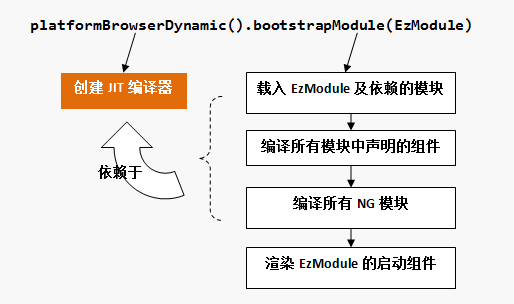
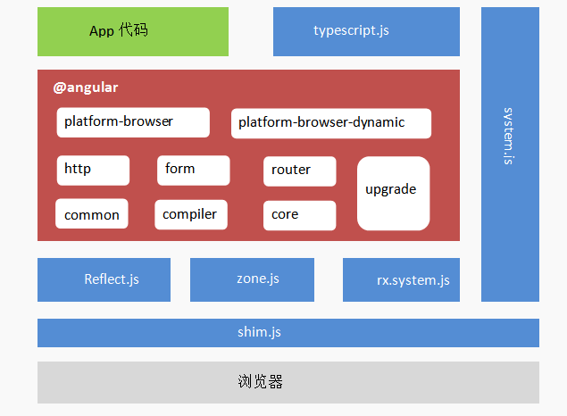

# angular

## 基础概念

```bash
npm install -g @angular/cli
ng new angular-tour-of-heroes
ng serve --open
ng generate component heroes
ng generate service hero
ng generate module app-routing --flat --module=app
```

### 名称解析

> Angular框架的核心是组件化，同时它的设计目标是适应大型应用的开发。因此，在应用开发中引入了模块（NgModule）的概念来组织不同的组件（及服务），一个Angular应用至少需要创建一个模块。
- NgModule装饰器声明了一些关键的元数据，来通知框架需要载入哪些NG模块、编译哪些组件以及启动引导哪些组件
  - **imports**： 需要引入的外部NG模块
  - **declarations**：本模块创建的组件，加入到这个元数据中的组件才会被编译
  - **bootstrap**：声明启动引导哪个组件，必须是编译过的组件
    - bootstrap元数据声明的组件必须是编译过的组件：它要么属于 使用imports元数据引入的外部NG模块，要么是已经在declarations元数据 中声明的本地组件。
  - selector：组件宿主元素的CSS选择符，声明了组件在DOM树中的渲染锚点
  - template：组件的模板，框架将以这个模板为蓝图构建视图
  - ServerModule：服务端实现
  - WorkerAppModule：WebWorker实现
  - BrowserModule封装了浏览器平台下的核心功能实现
  - 声明式开发: 元数据是用来向框架声明如何引导启动应用程序的重要信息。
- 组件就是指一个应用了Component装饰器的类。Component装饰器的作用， 就是为被装饰的类附加元数据信息
- platformBrowserDynamic()函数返回一个PlatformRef对象（Angular对平台的抽象），这个函数最重要的作用，在于其内部创建了一个即时（__J__ust __I__n __T__ime）编译器，可以在线实时编译NG模块和组件，这也是它被称为动态（Dynamic）的原因
- Angular是以其声明式的模板语法为核心提供API开发接口的，开发者书写的模板，经过框架相当复杂的编译处理，才渲染出最终的视图对象。



- 平台对象的bootstrapModule()方法用来启动指定的NG模块，启动的绝大部分工作，在于利用JIT编译器编译NG模块和组件，当这些编译工作都完成后，则根据启动模块的bootstrap元信息，渲染指定的组件。

### 简介

- **ng serve** 命令会构建本应用、启动开发服务器、监听源文件，并且当那些文件发生变化时重新构建本应用。
- **组件**是 Angular 应用中的基本构造块。 它们在屏幕上显示数据，监听用户输入，并且根据这些输入执行相应的动作。
- **双花括号语法**是 Angular 的插值绑定语法。
- **@Component** 是个装饰器函数，用于为该组件指定 Angular 所需的元数据。
  - CLI 自动生成了三个元数据属性
  - selector— 组件的选择器（CSS 元素选择器)
  - templateUrl— 组件模板文件的位置。
  - styleUrls— 组件私有 CSS 样式表文件的位置。
- **ngOnInit** 是一个生命周期钩子，Angular 在创建完组件后很快就会调用 ngOnInit。这里是放置初始化逻辑的好地方。
- 始终要 **export** 这个组件类，以便在其它地方（比如 AppModule）导入它。
- **管道** 是格式化字符串、金额、日期和其它显示数据的好办法。 Angular 发布了一些内置管道，而且你还可以创建自己的管道。
  - 绑定表达式中的 uppercase 位于**管道操作符**（ | ）的右边，用来调用内置管道 UppercasePipe。
- **[(ngModel)]** 是 Angular 的双向数据绑定语法。
  - 属于一个可选模块 FormsModule，你必须自行添加此模块才能使用该指令
- Angular 需要知道如何把应用程序的各个部分组合到一起，以及该应用需要哪些其它文件和库。 这些信息被称为**元数据（metadata）**。
- 每个组件都必须声明在（且只能声明在）一个 **NgModule** 中。
- ***ngFor** 是一个 Angular 的复写器（repeater）指令。 它会为列表中的每项数据复写它的宿主元素。
- @Component 元数据中指定的**样式和样式表**都是局限于该组件的。既不会影响到组件外的 HTML，也不会影响到其它组件中的 HTML。
- Angular 的 **CSS 类绑定**机制让根据条件添加或移除一个 CSS 类变得很容易。 只要把 [class.some-css-class]="some-condition" 添加到你要施加样式的元素上就可以了。
- 带有**@Input()**装饰器的输入属性，可以让外部的组件将会绑定到input，实现双向数据绑定。
- 把所有特性都放在同一个组件中，将会使应用“长大”后变得不可维护。把大型组件拆分成小一点的子组件，每个子组件都要集中精力处理某个特定的任务或工作流。
- 依靠 Angular 的**依赖注入**机制把它注入到 Component 的构造函数中来创建服务
  - 服务是在多个“互相不知道”的类之间共享信息的好办法
- **@Injectable()** 装饰器告诉 Angular 这个服务本身可能拥有被注入的依赖。 目前它还没有依赖，但是很快就会有了。 无论它会不会有，总是给服务加上这个装饰器都是一种好的做法。
- **XXService** 可以从任何地方获取数据：Web 服务、本地存储（LocalStorage）或一个模拟的数据源
- 让**构造函数**保持简单，只做初始化操作，比如把构造函数的参数赋值给属性。 构造函数不应该`做任何事`。它肯定不能调用某个函数来向远端服务（比如真实的数据服务）发起 HTTP 请求。
- Angular 只会绑定到组件的**公共**属性。

### 路由

- Angular 的最佳实践之一就是在一个独立的顶级模块中加载和配置**路由器**，它专注于路由功能，然后由根模块 AppModule 导入它。按照惯例，这个模块类的名字叫做 APPRoutingModule，并且位于 src/app 下的 app-routing.module.ts 文件中。
- **路由定义(Routes)** 会告诉路由器，当用户点击某个链接或者在浏览器地址栏中输入某个 URL 时，要显示哪个视图。
- 典型的 Angular 路由（Route）有两个属性：
  - path：一个用于匹配浏览器地址栏中 URL 的字符串
  - component：当导航到此路由时，路由器应该创建哪个组件。
- 初始化路由器，并让它开始监听浏览器中的地址变化。
- 把 RouterModule 添加到 @NgModule.imports 数组中，并用 routes 来配置它。你只要调用 imports 数组中的 RouterModule.forRoot() 函数
- **forRoot()**，是因为你要在应用的顶级配置这个路由器。 forRoot() 方法会提供路由所需的服务提供商和指令，还会基于浏览器的当前 URL 执行首次导航。
- path 中的冒号（:）表示 :id 是一个占位符，它表示某个特定英雄的 id。
- **ActivatedRoute** 保存着到这个 HeroDetailComponent 实例的路由信息。 这个组件对从 URL 中提取的路由参数感兴趣。
- **location** 是一个 Angular 的服务，用来与浏览器打交道。 稍后，你就会使用它来导航回上一个视图。
- **route.snapshot** 是一个路由信息的静态快照，抓取自组件刚刚创建完毕之后。
- **paramMap** 是一个从 URL 中提取的路由参数值的字典
- **路由参数**总会是字符串。 JavaScript 的 (+) 操作符会把字符串转换成数字，英雄的 id 就是数字类型。

### HTTP

- **HttpClient** 是 Angular 通过 HTTP 与远程服务器通讯的机制。
- 所有的 HttpClient 方法都会返回某个值的 RxJS Observable。
- HTTP 是一个请求/响应式协议。你发起请求，它返回单个的响应。
- 通常，Observable 可以在一段时间内返回多个值。 但来自 HttpClient 的 Observable 总是发出一个值，然后结束，再也不会发出其它值。
- HttpClient.get 默认情况下把响应体当做无类型的 JSON 对象进行返回。JSON 数据的具体形态是由服务器的数据 API 决定的。
- 要捕获错误，你就要使用 RxJS 的 catchError() 操作符来建立对 Observable 结果的处理管道（pipe）。
- catchError() 操作符会拦截失败的 Observable。 它把错误对象传给错误处理器，错误处理器会处理这个错误。
- 作为一条通用的规则，Observable 在有人订阅之前什么都不会做。
- **$** 是一个命名惯例，用来表明 heroes$ 是一个 Observable，而不是数组。
- *ngFor 不能直接使用 Observable。 不过，它后面还有一个管道字符（|），后面紧跟着一个 async，它表示 Angular 的 AsyncPipe。
- AsyncPipe 会自动订阅到 Observable，这样你就不用再在组件类中订阅了。
- Subject 既是可观察对象的数据源，本身也是 Observable。 你可以像订阅任何 Observable 一样订阅 Subject。
- switchMap() 会记住原始的请求顺序，只会返回最近一次 HTTP 方法调用的结果。

### 架构概览

- Angular 的基本构造块是 NgModule，它为组件提供了编译的上下文环境。NgModule 会把相关的代码收集到一些功能集中。Angular 应用就是由一组 NgModule 定义出的。 应用至少会有一个用于引导应用的根模块，通常还会有很多特性模块。

